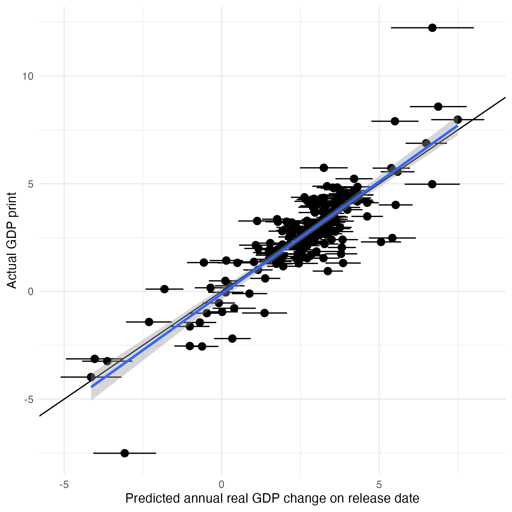

# econ-data-tracker

# Methodology

This repo contains code to create a weekly updating average of politically salient economic indicators. 

I use a dynamic factor model to aggregate indicators to jointly predict annual change in Gross Domestic Product and changes in support for the incumbent political party in presidential elections.

The model fits an underlying latent trend --- "the economy" --- to predict measurement values of 16 different economic variables, ranging from unemployment and manufacturing output to trade exports and government spending. The variables have been selected based on their individual correlation to historical election outcomes, as well as their effect on the ability of the resulting index to predict change in political support. 

You can think of this estimate as similar to the GDP now-casts from the New York and Atlanta Fed banks, with the added wrinkle that we are not asking “What is GDP growth today, according to all the latest data I have?” it’s “What is GDP growth today if we reconstructed GDP using the variables that best predict presidential outcomes?”

## Fit
These graphs show how well the model predicts GDP change on dates of GDP releases for the prior quarter, and election results:

#### Resources

[NY Fed nowcast methodology](https://www.newyorkfed.org/medialibrary/media/research/blog/2023/NYFed-Staff-Nowcast_technical-paper)

